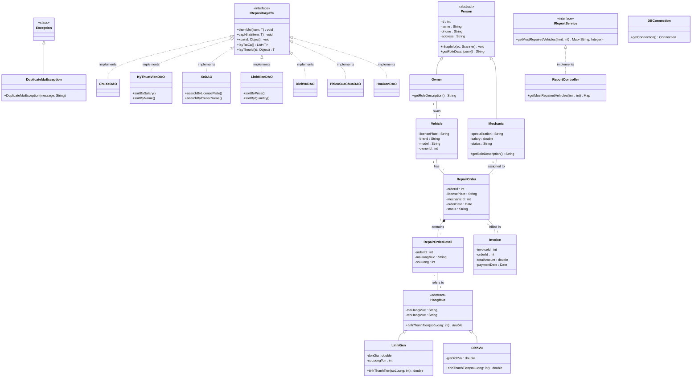

# Sơ đồ Lớp (Class Diagram) - Quản Lý Gara

Dưới đây là sơ đồ lớp cho dự án Quản lý Gara, được viết dưới dạng Mermaid. Bạn có thể xem trực tiếp trên GitHub hoặc các công cụ hỗ trợ Markdown.



---

## Cấu trúc thư mục (Dạng cây)

```text
Quản Lý Gara (OOP Project)
│
├── model/ (Thực thể & Dữ liệu)
│   ├── Person (Abstract)
│   │   ├── Owner (Kế thừa Person)
│   │   └── Mechanic (Kế thừa Person)
│   │
│   ├── HangMuc (Abstract)
│   │   ├── LinhKien (Kế thừa HangMuc)
│   │   └── DichVu (Kế thừa HangMuc)
│   │
│   ├── Vehicle
│   ├── RepairOrder
│   ├── RepairOrderDetail
│   ├── Invoice
│   └── DuplicateMaException (Kế thừa Exception)
│
└── controller/ (Xử lý nghiệp vụ & Database)
    ├── IRepository<T> (Interface CRUD Generic)
    │   ├── ChuXeDAO
    │   ├── KyThuatVienDAO
    │   ├── XeDAO
    │   ├── PhieuSuaChuaDAO
    │   ├── LinhKienDAO
    │   ├── DichVuDAO
    │   └── HoaDonDAO
    │
    ├── IReportService (Interface Báo cáo)
    │   └── ReportController
    │
    └── DBConnection (Kết nối MySQL)
```
