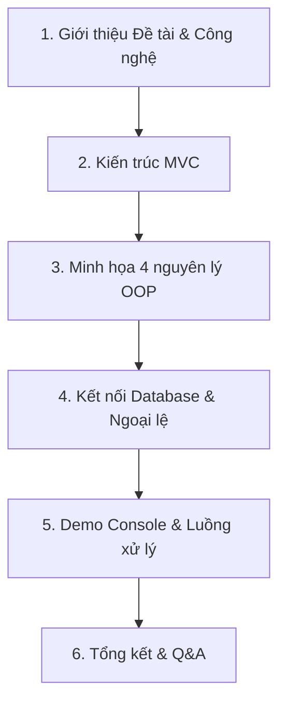

# TÀI LIỆU HƯỚNG DẪN THUYẾT TRÌNH DỰ ÁN HỆ THỐNG QUẢN LÝ GARA
*(Chia làm 2 kịch bản: Thuyết trình cho **Khách hàng** và Thuyết trình cho **Giáo viên hội đồng**)*

---

# PHẦN A: KỊCH BẢN THUYẾT TRÌNH DÀNH CHO KHÁCH HÀNG (DOANH NGHIỆP)
*Trọng tâm: Tính tiện ích, giao diện, tối ưu hóa quy trình kinh doanh và kiểm soát thất thoát.*

## 📋 CẤU TRÚC BÀI NÓI (10 phút)

### 1. Đặt vấn đề (2 phút)
> *"Kính chào Quý khách hàng. Tôi đại diện cho nhóm phát triển dự án **GaraPro**.
> Hiện nay, việc quản lý một Gara ô tô thủ công gặp nhiều bất cập: dễ sai sót hóa đơn, khó kiểm kho linh kiện, và không theo dõi được hiệu suất làm việc của thợ máy. GaraPro ra đời như một giải pháp số hóa toàn diện giúp tự động hóa và tối ưu quy trình kinh doanh của Quý khách."*

### 2. Giới thiệu các chức năng cốt lõi (3 phút)
> *"GaraPro giúp Quý khách vận hành trơn tru qua 4 phân hệ chính:
> *   **Tiếp nhận xe:** Ghi nhận thông tin chủ xe và xe vào xưởng nhanh chóng.
> *   **Phân công thợ máy:** Điều phối công việc tự động dựa theo trạng thái rảnh/bận của thợ máy.
> *   **Quản lý kho phụ tùng:** Tự động cập nhật số lượng tồn kho linh kiện mỗi khi thay thế.
> *   **Hóa đơn tức thì:** Tự động tính toán tổng chi phí sửa chữa và in hóa đơn thanh toán minh bạch."*

### 3. Demo Giao diện Web Prototype (3 phút)
> *(Trình chiếu tệp [index.html](file:///c:/Users/CHAU%20TUAN%20KIET/Desktop/OOP_ck/index.html) trên trình duyệt)*
> *"Để chứng minh tầm nhìn phát triển lâu dài, chúng tôi thiết kế giao diện Web hiện đại. Người quản lý có thể xem doanh thu trực quan qua biểu đồ, kiểm tra danh sách xe đang sửa chữa và kiểm soát xuất kho chỉ với vài click chuột."*

### 4. Giá trị mang lại & Cam kết (2 phút)
> *"Phần mềm giúp tiết kiệm 50% thời gian xử lý thủ tục, ngăn chặn 100% thất thoát phụ tùng kho và gia tăng mức độ hài lòng của khách hàng nhờ quy trình chuyên nghiệp."*

---
---

# PHẦN B: KỊCH BẢN THUYẾT TRÌNH DÀNH CHO GIÁO VIÊN HỘI ĐỒNG (BẢO VỆ ĐỒ ÁN)
*Trọng tâm: Kiến trúc phần mềm MVC, áp dụng 4 nguyên lý Lập trình hướng đối tượng (OOP), chuẩn hóa Database MySQL, xử lý ngoại lệ và thiết kế mã nguồn.*

## 📋 CẤU TRÚC BÀI NÓI (12 - 15 phút)

### 1. Đặt vấn đề dưới góc nhìn Khoa học (2 phút)
* **Lời thoại gợi ý:**
  > *"Kính thưa Thầy/Cô trong Hội đồng chấm đồ án. Em tên là [Tên bạn]. Đề tài đồ án cuối kỳ của em là **'Xây dựng Hệ thống Quản lý Gara Ô tô áp dụng các nguyên lý Hướng đối tượng'**.
  > 
  > Mục tiêu của đề tài là thiết kế một hệ thống quản lý có tính module hóa cao, dễ dàng bảo trì và nâng cấp, đồng thời áp dụng chặt chẽ kiến trúc phần mềm chuẩn nghiệp vụ."*

### 2. Kiến trúc Hệ thống & Mô hình MVC (2 phút)
* **Lời thoại gợi ý:**
  > *"Dự án được xây dựng dựa trên kiến trúc **MVC (Model - View - Controller)** để đảm bảo sự độc lập giữa các tầng xử lý dữ liệu:
  > *   **Tầng Model (Lớp dữ liệu):** Định nghĩa cấu trúc thực thể như [Person.java](file:///c:/Users/CHAU%20TUAN%20KIET/Desktop/OOP_ck/QuanLyGara/src/main/java/com/mycompany/quanlygara/model/Person.java), [HangMuc.java](file:///c:/Users/CHAU%20TUAN%20KIET/Desktop/OOP_ck/QuanLyGara/src/main/java/com/mycompany/quanlygara/model/HangMuc.java)... ứng dụng tối đa OOP.
  > *   **Tầng View (Giao diện):** Hiện tại hệ thống sử dụng giao diện dòng lệnh `ConsoleView` để tương tác trực tiếp với người dùng và có hướng phát triển giao diện Web qua bản mock `index.html`.
  > *   **Tầng Controller (Điều khiển):** Đóng vai trò cầu nối, tiếp nhận yêu cầu từ View, tương tác với Database thông qua JDBC và trả kết quả về View."*

### 3. Trọng tâm: Hiện thực hóa 4 Tính chất của Lập trình Hướng đối tượng (OOP) (4 phút)
*(Đây là phần giáo viên sẽ hỏi nhiều nhất, hãy trình bày chủ động để ghi điểm)*

* **Lời thoại gợi ý:**
  > *"Em đã áp dụng triệt để 4 nguyên lý cốt lõi của OOP vào thiết kế lớp thực thể:
  > 
  > 1.  **Tính Đóng gói (Encapsulation):**
  >     *   Tất cả thuộc tính trong các lớp Model đều để phạm vi truy cập `private` (ví dụ: `id`, `name`, `salary`...).
  >     *   Dữ liệu chỉ được đọc/ghi thông qua các phương thức Getter/Setter công khai (`public`). 
  >     *   Đồng thời, dữ liệu đầu vào được kiểm soát tính hợp lệ (Data Validation) bằng biểu thức chính quy (Regex) ở phương thức nhập.
  > 
  > 2.  **Tính Kế thừa (Inheritance):**
  >     *   Lớp [Mechanic.java](file:///c:/Users/CHAU%20TUAN%20KIET/Desktop/OOP_ck/QuanLyGara/src/main/java/com/mycompany/quanlygara/model/Mechanic.java) (Thợ máy) và [Owner.java](file:///c:/Users/CHAU%20TUAN%20KIET/Desktop/OOP_ck/QuanLyGara/src/main/java/com/mycompany/quanlygara/model/Owner.java) (Chủ xe) được thừa kế các thuộc tính chung từ lớp cha [Person.java](file:///c:/Users/CHAU%20TUAN%20KIET/Desktop/OOP_ck/QuanLyGara/src/main/java/com/mycompany/quanlygara/model/Person.java) thông qua từ khóa `extends`.
  >     *   Lớp [DichVu.java](file:///c:/Users/CHAU%20TUAN%20KIET/Desktop/OOP_ck/QuanLyGara/src/main/java/com/mycompany/quanlygara/model/DichVu.java) và [LinhKien.java](file:///c:/Users/CHAU%20TUAN%20KIET/Desktop/OOP_ck/QuanLyGara/src/main/java/com/mycompany/quanlygara/model/LinhKien.java) kế thừa từ lớp cha [HangMuc.java](file:///c:/Users/CHAU%20TUAN%20KIET/Desktop/OOP_ck/QuanLyGara/src/main/java/com/mycompany/quanlygara/model/HangMuc.java).
  > 
  > 3.  **Tính Đa hình (Polymorphism):**
  >     *   **Nạp chồng (Overloading):** Thể hiện qua việc nạp chồng các Constructor (không tham số và đầy đủ tham số) để linh hoạt trong việc khởi tạo đối tượng.
  >     *   **Ghi đè (Overriding):** Thể hiện qua việc ghi đè `@Override` các phương thức `nhapInfo()`, `toString()` và đặc biệt là phương thức trừu tượng `tinhThanhTien(int soLuong)`.
  >     *   **Đa hình lúc chạy (Runtime Polymorphism):** Khi tính tiền đơn hàng sửa chữa, hệ thống gọi phương thức `tinhThanhTien` từ danh sách `List<HangMuc>`. Trình biên dịch sẽ tự động quyết định gọi phương thức của `DichVu` (tính tiền trọn gói) hay `LinhKien` (đơn giá x số lượng) tùy vào kiểu đối tượng thực tế lúc chạy.
  > 
  > 4.  **Tính Trừu tượng (Abstraction):**
  >     *   Sử dụng lớp trừu tượng `abstract class Person` và `abstract class HangMuc` nhằm mục đích định hình bộ khung thiết kế mà không cho phép khởi tạo đối tượng trực tiếp từ chúng.
  >     *   Định nghĩa phương thức trừu tượng `public abstract double tinhThanhTien(int soLuong);` để ẩn đi chi tiết tính tiền cụ thể của từng loại hạng mục."*

### 4. Kết nối Database & Xử lý Ngoại lệ (2 phút)
* **Lời thoại gợi ý:**
  > *"Về mặt lưu trữ, hệ thống kết nối cơ sở dữ liệu MySQL qua **JDBC**. 
  > Để đảm bảo tính bền vững của mã nguồn:
  > *   Em sử dụng khối lệnh `try-catch-finally` hoặc `try-with-resources` để tự động đóng kết nối cơ sở dữ liệu, tránh rò rỉ tài nguyên hệ thống.
  > *   Đồng thời, em đã tạo ra ngoại lệ tùy chỉnh **`DuplicateMaException`** để kiểm soát lỗi nghiệp vụ khi người dùng cố tình thêm mã hạng mục bị trùng lặp trong hệ thống."*

### 5. Demo Luồng Hoạt Động (3 phút)
*(Chạy chương trình Java console, chọn chức năng lập Đơn Sửa Chữa -> Tính tiền hóa đơn)*
* **Lời thoại gợi ý:**
  > *"Sau đây em xin phép chạy demo chương trình:
  > *   Đầu tiên hệ thống hiển thị menu console trực quan.
  > *   Em tiến hành tạo một Đơn sửa chữa mới cho xe. Hệ thống sẽ truy vấn Database xem thợ máy nào đang ở trạng thái 'Đang rảnh' để gợi ý phân công.
  > *   Tiếp theo em thêm các hạng mục sửa chữa bao gồm thay dầu (Dịch vụ) và thay lốp xe (Linh kiện).
  > *   Cuối cùng, hệ thống tính tiền, xuất hóa đơn và tự động lưu trữ trạng thái xe đã hoàn thành, đồng thời cập nhật lại trạng thái thợ máy sang 'Đang rảnh'."*

### 6. Lời kết (1 phút)
* **Lời thoại gợi ý:**
  > *"Đồ án này đã giúp em hiểu sâu sắc cách tổ chức mã nguồn chuẩn MVC và áp dụng hiệu quả các tư duy hướng đối tượng OOP vào giải quyết bài toán thực tế. Em xin chân thành cảm ơn Thầy/Cô đã lắng nghe và rất mong nhận được câu hỏi góp ý từ Hội đồng."*

---

## 💡 CÁC CÂU HỎI THƯỜNG GẶP CỦA GIÁO VIÊN VÀ CÁCH TRẢ LỜI:

1. **Câu hỏi:** *Tại sao lại chọn lớp Person và HangMuc làm Abstract Class mà không phải Interface?*
   * **Trả lời:** Vì lớp cha `Person` và `HangMuc` có chứa các thuộc tính chung (như tên, số điện thoại, đơn giá...) và các phương thức có mã nguồn cụ thể (như getter, setter, `nhapInfo`). Interface trong Java không thể chứa các thuộc tính trạng thái (state) ngoại trừ hằng số `public static final`, nên việc dùng Abstract Class ở đây là phù hợp nhất để tối ưu kế thừa thuộc tính.

2. **Câu hỏi:** *Hãy chỉ ra đoạn code thể hiện tính Đa hình lúc chạy (Runtime Polymorphism) trong chương trình?*
   * **Trả lời:** Hãy mở code phần lập hóa đơn hoặc tính tổng tiền đơn hàng (trong `RepairOrder` hoặc `Invoice`). Giải thích rằng khi duyệt danh sách `List<HangMuc> items` và gọi `item.tinhThanhTien()`, mặc dù biến tham chiếu có kiểu dữ liệu là `HangMuc`, nhưng Java sẽ tự động gọi phương thức tính tiền của lớp con thực tế lúc chạy (`DichVu` hoặc `LinhKien`).

3. **Câu hỏi:** *Việc đóng gói (Encapsulation) mang lại lợi ích gì trong dự án này?*
   * **Trả lời:** Nó giúp ngăn chặn việc gán dữ liệu sai cấu trúc hoặc không hợp lệ. Ví dụ: Lương thợ máy (`salary`) hay Đơn giá linh kiện (`donGia`) không được phép âm (<0). Nhờ đóng gói thuộc tính `private` và kiểm tra logic `>= 0` trong phương thức Setter/nhapInfo, ta đảm bảo dữ liệu trong Database luôn sạch và chính xác.
